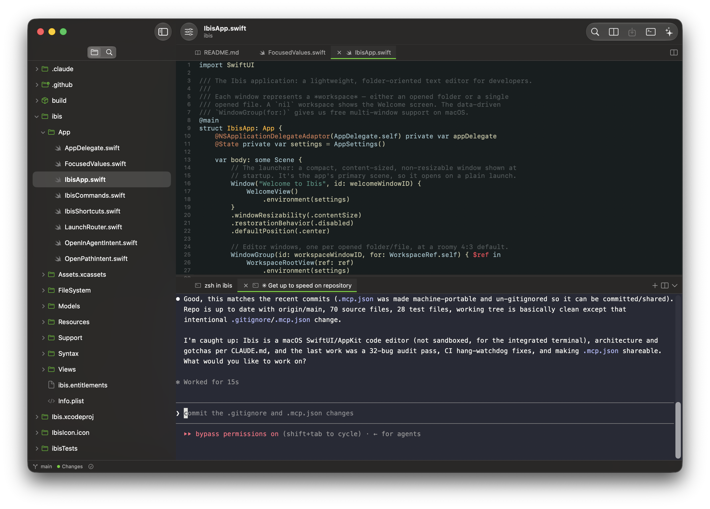
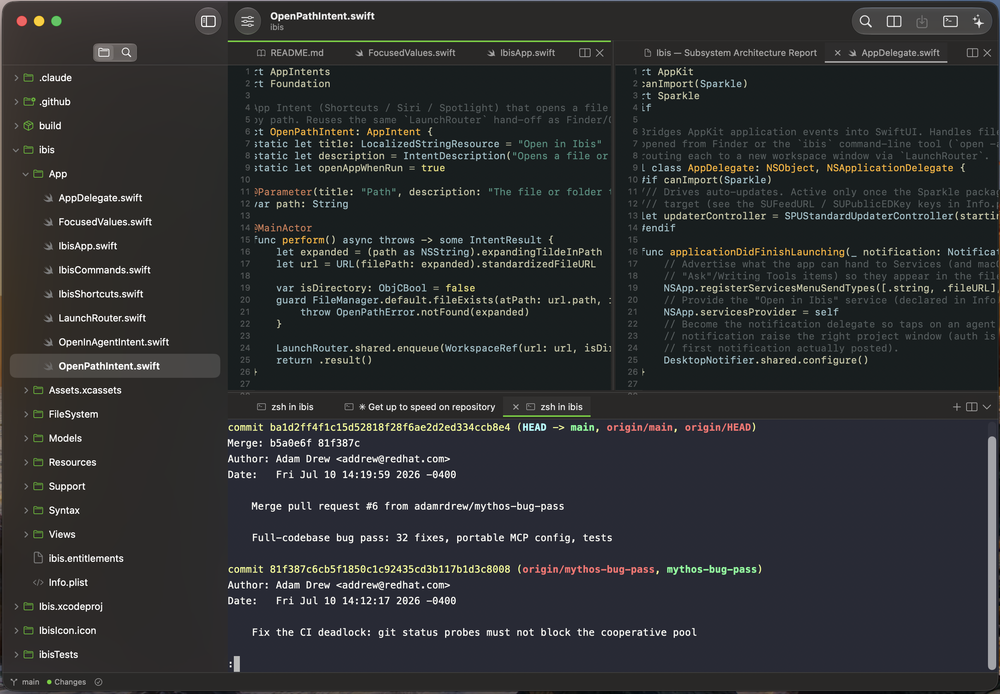
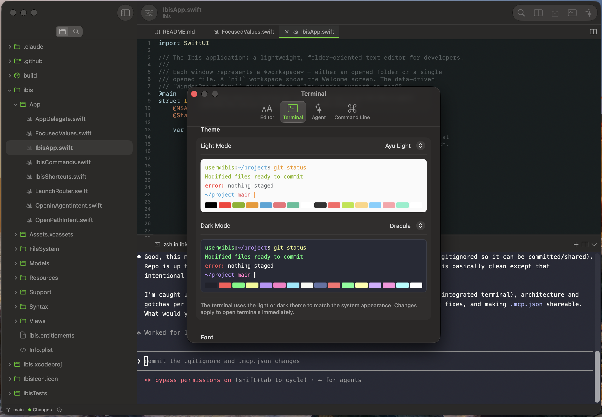
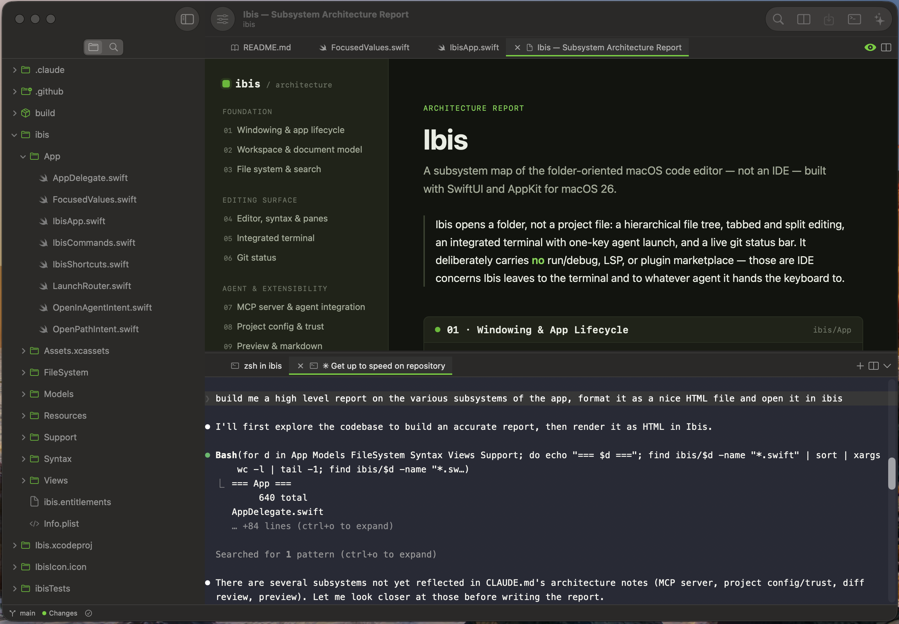

# Ibis

A lightweight, folder-oriented, agent-integrated code editor for macOS.

In the age of agentic development full featured IDEs can feel bloated. The agent
does all of the heavy lifting: running, debugging, taking advantage of LSPs, searching
and comparing files and diffs. A lot of the IDE surface area just isn't valuable anymore.
Tools like Claude Code, Codex, and Antigravity have replaced the traditional IDE for
many developers. But these tools have problems too. What if you want to edit a README or some
docs by hand, or edit a config file, or make some minor edits and tweaks to files? These tools
don't provide that classic IDE experience. So, you end up having a terminal window and an editor
window open for your projects, and they don't talk to eachother.

Ibis is the code editor for the agentic age. Work with your agents and your files in a single
light weight Mac native app. Browse files, make edits and changes, and launch your agent with 
a single keyboard shortcut. Your agent can connect to Ibis to present complex data and reports in the
GUI instead of dumping to the terminal. It can send you nice diff visualizations for your approval. 
And you can get notifications from your agents if they need your attention while your focus is 
elsewhere. 



## Features

- **Folder-first workflow.** Open a folder and browse a hierarchical file tree
  backed by a native `NSOutlineView` — double-click rename, Finder drag in/out,
  ⌥-copy, and the standard context menu all work.
- **Tabs and split panes.** Edit across resizable split panes with a unified
  divider system; tabs reorder by drag. Layout and selection are restored per
  folder when you reopen it.
- **Syntax highlighting** for a wide range of languages (highlight.js via the
  HighlighterSwift engine, behind a swappable seam).
- **Project search** across the whole folder.
- **Integrated terminal** (SwiftTerm) with tabs, dockable to the bottom or the
  trailing edge, spawning a real login shell — plus one-key launch of your
  configured coding agent in a new terminal tab rooted at the workspace, and
  light/dark terminal color themes with live previews in Settings.
- **Live Git status bar** that refreshes as you commit or switch branches in the
  terminal.
- **Markdown & HTML preview** rendered in a `WKWebView`.
- **Multiple entry points.** Open from Finder, the `ibis` CLI, the "Open in
  Ibis" Services menu item, and Shortcuts / Siri via App Intents.
- **Unsaved-change protection.** Confirms before closing tabs or windows with
  unsaved work.

<p>
  
  
</p>

## Agent integration

Ibis embeds an **MCP server** that the coding agent you launch can connect to,
so the agent works *with* the editor instead of dumping everything to the
terminal:

- `open_file`, `reveal_in_tree`, `get_active_file`, `get_open_tabs`,
  `get_selection`, `get_workspace_root` — read and navigate the workspace.
- `open_content` — render a report, summary, or draft in a new tab (Markdown /
  HTML render; text stays editable).
- `propose_edit` / `propose_patch` — the agent sends an intended change and Ibis
  shows **you** a diff; the change applies and saves only if you approve.
- `notify` / `ask_human` — surface a message or ask a question.



Supported agents (each has its own MCP-config file format, which Ibis writes):
**Claude Code**, **Codex**, **Antigravity**, plus a **Custom** command. For
Claude, Ibis also injects orientation via `--append-system-prompt` at launch;
other agents learn the tools through the MCP tool descriptions.

### Per-project config and trust

A folder can carry a `.ibis.json` with named actions (build / test / lint / …)
and environment variables injected into its terminal sessions. Because that file
can execute code, opening a folder does **not** trust it automatically —
VS Code-style, you must trust a folder once before Ibis applies its environment
or exposes its actions. A hardcoded denylist of shell/loader-hijacking
environment keys is refused regardless of trust.

## Requirements

- macOS **26.0** (Tahoe) or later.
- Xcode 26 or the Xcode 27 beta to build.

## Building

Ibis is developed from inside Xcode.

```
open Ibis.xcodeproj
```

Then build and run the `ibis` scheme (⌘R). The package dependencies
(HighlighterSwift, SwiftTerm, SwiftMCP, and their transitive packages) resolve
on first open; `Package.resolved` is committed.

> **Note:** `xcodebuild` on the command line needs the SwiftMCP-related package
> pins already present in the project (see `CLAUDE.md` → *Dependencies*). The
> Xcode IDE builds without extra steps.

## Distribution & security

Ibis ships as a Developer ID-signed, **notarized** app distributed from the web
— not the Mac App Store — the same model as VS Code, iTerm2, and Xcode. The App
Sandbox is intentionally **off** so the integrated terminal can spawn a real,
useful login shell (a sandboxed child shell is crippled). Hardened Runtime stays
on, as notarization requires.

## Architecture

Sources live under `ibis/`, organized into `App/`, `Models/`, `FileSystem/`,
`Syntax/`, `Views/`, and `Support/`. The models are `@Observable` /
`@MainActor`; the UI is SwiftUI with AppKit where a native control is needed
(the file tree, the code editor's `NSTextView`, the terminal). See
[`CLAUDE.md`](CLAUDE.md) for a detailed component map and the hard-won
implementation notes.

## Name

Ibis — after the bird. The hero accent is kelly green (`Color.ibisKelly`), used
sparingly.
